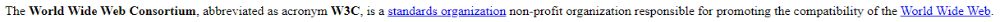
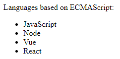
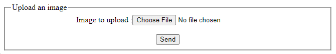

1. Using only JS, generate the necessary HTML to re-create the text in the image: 

   The text includes parts in bold and parts that are anchor links to remote websites. The "standards organization" text should link to https://en.wikipedia.org/wiki/Standards_organization and the "World Wide Web" text should link to https://en.wikipedia.org/wiki/World_Wide_Web_Consortium on your finished result.

1. Using the following array:  
   ```js
   let languages = ['JavaScript', 'Node', 'Vue', 'React'];
   ```
   Create an unordered list with only JS that will appear in a browser like the following image:  
   

1. Create an HTML file uploading section using only JS that will appear like the following image:  
     

   Note that the "No file chosen" text is automatically produced by the input element.
   